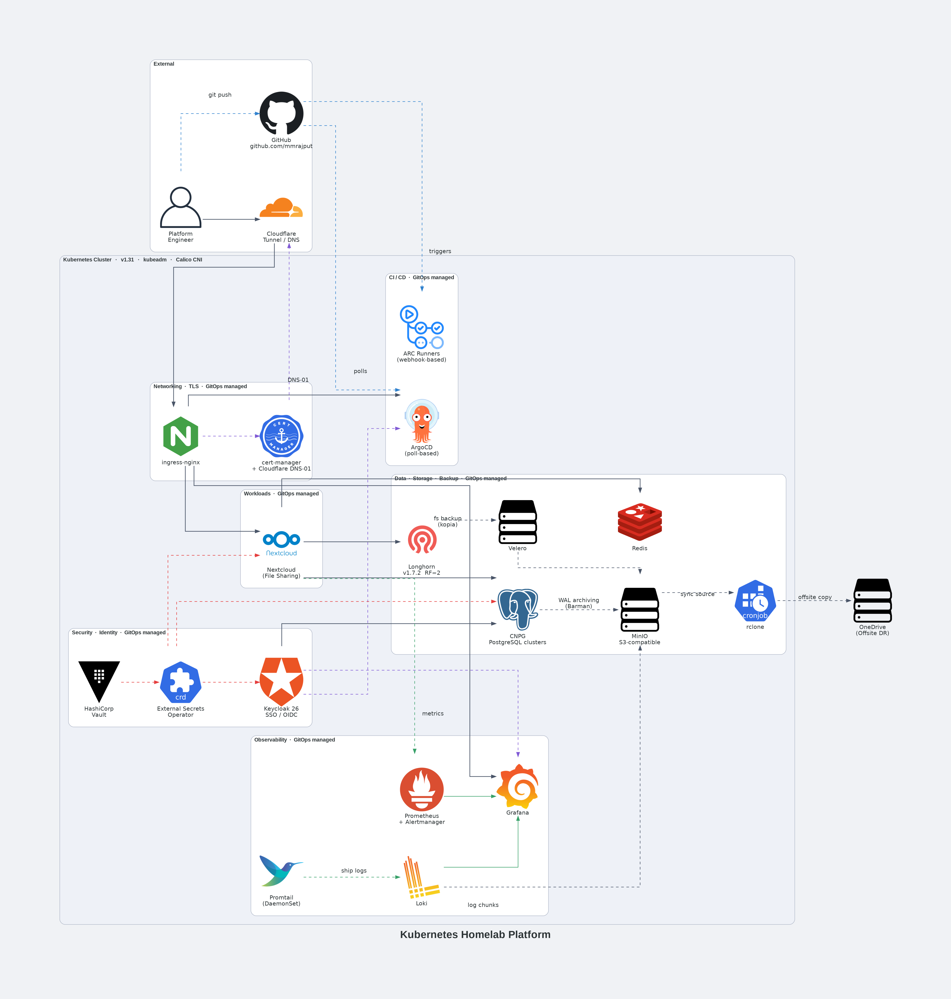

# Kubernetes Single-Cluster Platform

[](https://kubernetes.io/)
[](https://www.proxmox.com/)
[](https://ubuntu.com/)
[](https://argoproj.github.io/cd/)
[](https://prometheus.io/)
[](https://grafana.com/)
[](https://www.cloudflare.com/)
[](LICENSE)

> A 3-node Kubernetes cluster on Proxmox VE — kubeadm, Calico, ArgoCD, full observability, secrets management, identity, and stateful workloads.

---

## What's Next

This repo is the **foundation**. The next iteration — [**kubernetes-multi-cluster-platform**](https://github.com/mmrajput/kubernetes-multi-cluster) — rebuilds the platform with enterprise-grade tooling:

- **Talos Linux** (immutable OS, no SSH)
- **Cilium** with eBPF, kube-proxy replacement, and Gateway API
- **SPIFFE/SPIRE** for workload identity
- **vCluster** for staging/production isolation
- **ArgoCD Hub** multi-cluster GitOps

---

## Architecture



### Legends
- Grey solid                User request traffic (Cloudflare → ingress → workload)
- Grey dashed               Backup and DR flows (Velero → MinIO → rclone → OneDrive)
- Blue dashed               GitOps reconciliation (GitHub → ArgoCD → cluster)
- Purple dashed             Webhook certificate provisioning and SSO authentication
- Red dashed                Secret injection (Vault → ESO → workloads)
- Green dashed              Metrics scraping and log shipping (Promtail → Loki)
- Green solid               Dashboard query flows (Grafana → Prometheus / Loki)
---

The diagram above illustrates the full platform architecture, deployed on a three-node kubeadm v1.31 cluster with Calico CNI. The platform is organised into six functional concern groups, all managed declaratively via GitOps.

### External Layer
- The platform engineer interacts with the cluster exclusively through Git — all changes are commits, never direct `kubectl apply`
- Code changes are pushed to GitHub as the single source of truth — ArgoCD reconciles the cluster state from there continuously
- Image promotion workflows are triggered manually via GitHub Actions, executed by ARC self-hosted runners running inside the cluster
- All external access is routed through **Cloudflare Tunnel**, providing secure ingress without any open inbound ports on the home network
- TLS is terminated at the Cloudflare edge — no inbound ports are exposed on the home network

### Networking · GitOps managed
- **ingress-nginx** routes all external traffic to internal services using host-based Ingress rules
- **cert-manager** manages TLS certificates for operator admission webhooks (CNPG, ESO) — TLS for external traffic is terminated at the Cloudflare edge
- **NetworkPolicies** enforce default-deny across every namespace — all inter-service communication is explicitly declared, preventing lateral movement between platform components and workloads

### CI/CD · GitOps managed
- **ARC (Actions Runner Controller)** runs self-hosted GitHub Actions runners inside the cluster in webhook-based scale-to-zero mode
- **ArgoCD** continuously reconciles cluster state against Git in poll mode (every 120s)
- The CI pipeline pulls upstream images from Docker Hub, scans them with Trivy, mirrors them to ghcr.io via crane, and commits the updated image tag to the Git values file — no custom images are built
- ArgoCD detects the tag change in Git and syncs the cluster automatically

### Workloads · GitOps managed
- **Nextcloud** is the primary platform workload, deployed for sovereign file sharing
- **CloudNativePG** manages the PostgreSQL database storing Nextcloud's metadata, user accounts, and application state
- **Longhorn** provides the replicated persistent volume (RF=2) for user file storage
- **Redis** handles session caching and file-locking to prevent write conflicts under concurrent access
- **Keycloak** provides SSO for Nextcloud via the `user_oidc` app, configured through the Nextcloud Admin UI
- Nextcloud was chosen as the reference workload because it exercises every platform layer simultaneously — storage, databases, identity, secrets, observability, backup, and networking

### Data · Storage · Backup · GitOps managed
- **Longhorn v1.7.2** (RF=2) is the default StorageClass, providing replicated block storage across worker nodes
- **CloudNativePG (CNPG)** manages PostgreSQL clusters, continuously archiving WAL to MinIO via Barman for point-in-time recovery
- **MinIO** (S3-compatible) is the central object store, backing Loki log storage, Velero backup snapshots, and CNPG WAL archives
- **Velero** backs up Kubernetes resources and persistent volumes via Kopia, storing snapshots in MinIO
- **rclone** runs as a nightly CronJob, syncing both MinIO buckets to OneDrive for an offsite DR copy — completing the 3-2-1 backup posture

### Security · Identity · GitOps managed
- **HashiCorp Vault** (KV v2) is the secrets backend, storing all platform secrets under component-namespaced paths
- **External Secrets Operator (ESO)** synchronises secrets from Vault into workloads, databases, and platform services as native Kubernetes Secret objects — no application reads from Vault directly
- **Keycloak 26** provides centralised OIDC identity for the platform, with SSO integrated across ArgoCD and Grafana via the homelab realm

### Observability · GitOps managed
- **Prometheus & Alertmanager** scrape metrics from all platform components and manage alerting rules
- **Grafana** visualises metrics from Prometheus and log data from Loki on unified dashboards
- **Loki** aggregates logs from across the cluster, backed by MinIO for durable log chunk storage
- **Promtail** runs as a DaemonSet on every node, collecting and shipping container and system logs to Loki

### Data Flow Summary

| Flow | Path |
|------|------|
| External traffic | Cloudflare → cloudflared → nginx-ingress → workloads |
| Secrets | Vault → ESO → Kubernetes Secrets → workloads · databases · platform services |
| User files | Workloads → Longhorn PVC |
| Database | CNPG (PostgreSQL) → WAL archiving → MinIO |
| Backup | Velero (Kopia) → MinIO · CNPG Barman → MinIO |
| Offsite DR | MinIO → rclone → OneDrive |
| Metrics | All components → Prometheus → Grafana |
| Logs | All nodes → Promtail → Loki (MinIO-backed) → Grafana |
---

## Current Status

| Phase | Description | Status |
|-------|-------------|--------|
| Phase 0 | Architecture Design & Planning | ✅ Complete |
| Phase 1 | Development Environment (DevContainers) | ✅ Complete |
| Phase 2 | Virtualization Foundation (Proxmox VE) | ✅ Complete |
| Phase 3 | VM Provisioning (cloud-init + Ansible) | ✅ Complete |
| Phase 4 | Kubernetes Cluster (kubeadm + Calico) | ✅ Complete |
| Phase 5 | GitOps & Platform Services (ArgoCD) | ✅ Complete |
| Phase 6 | Observability Stack (Prometheus + Loki + Grafana) | ✅ Complete |
| Phase 7 | Security Hardening (cert-manager + NetworkPolicies + Vault + ESO) | ✅ Complete |
| Phase 8 | Storage & Backup (Longhorn + MinIO + Velero) | ✅ Complete |
| Phase 9 | Identity & Stateful Workloads (Keycloak + CloudNativePG + Nextcloud) | ✅ Complete |
| Phase 10 | CI/CD Pipeline (ARC + GitHub Actions) | ✅ Complete |

---

## Platform Stack

| Layer | Technology |
|-------|------------|
| Hypervisor | Proxmox VE 8.x |
| OS | Ubuntu 24.04 LTS · cloud-init |
| Kubernetes | v1.31 · kubeadm · 1 control plane · 2 workers |
| CNI | Calico |
| GitOps | ArgoCD (App-of-Apps) |
| Ingress | nginx-ingress · Cloudflare Tunnel |
| Observability | Prometheus · Grafana · Loki · Promtail |
| Security | cert-manager · Vault · External Secrets Operator · Falco |
| Identity | Keycloak · CloudNativePG |
| Storage | Longhorn · MinIO · Velero |
| CI/CD | GitHub Actions ARC · ghcr.io |
| Workloads | Nextcloud · Homepage |

---

## Repository Structure

```
bootstrap/namespaces/    # One-time namespace setup (kubectl apply, not ArgoCD)
platform/
  argocd/               # Root app + AppSets per category
  networking/           # cert-manager, nginx-ingress, NetworkPolicies
  security/             # Vault, Keycloak, External Secrets
  data/                 # CNPG clusters, Longhorn, MinIO, Velero, rclone
  observability/        # Prometheus, Grafana, Loki, Promtail
  ci-cd/                # ARC systems + runners
workloads/              # Helm values per app (staging / production)
infra/                  # Ansible + Proxmox scripts
docs/                   # ADRs, guides, runbooks, reference
scripts/                # Dev shell, diagrams, helpers
```

---

## Documentation

| Document | Description |
|----------|-------------|
| [Reproduction Guide](docs/guides/homelab-reproduction-guide.md) | End-to-end guide to reproduce this homelab from scratch |
| [Platform Inventory](docs/reference/platform-inventory.md) | Service endpoints, ArgoCD app inventory |
| [Workload Onboarding](docs/reference/workload-onboarding.md) | Step-by-step guide for adding workloads |
| [Data Layer](docs/reference/data-layer.md) | CNPG, Vault, ESO secrets inventory |
| [Network Topology](docs/architecture/network-topology.md) | Network architecture, Calico, Cloudflare Tunnel, NetworkPolicy |
| [Architecture Decisions](docs/adr/) | ADRs 001–016 with context and rationale |
| [Troubleshooting](docs/guides/troubleshooting.md) | Platform-level troubleshooting across all components |
| [Runbooks](docs/runbooks/) | Operational procedures (backup, DR, Vault, certificates) |

---

## Connect

- **LinkedIn:** [linkedin.com/in/mahmood-rajput](https://www.linkedin.com/in/mahmood-rajput/)
- **Email:** mahmoodrajput.cloud@gmail.com

---

*Last updated: April 2026 · Altdorf 71155, Germany*
