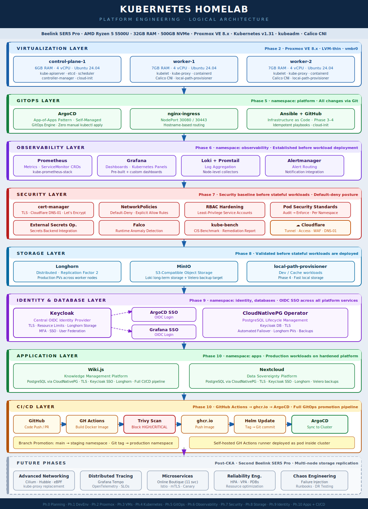

# Kubernetes Homelab — Platform Engineering Project

[](https://kubernetes.io/)
[](https://www.proxmox.com/)
[](https://ubuntu.com/)
[](https://argoproj.github.io/cd/)
[](https://prometheus.io/)
[](https://grafana.com/)
[](https://www.cloudflare.com/)
[](LICENSE)


> **A production-grade 3-node Kubernetes homelab built on Proxmox VE, demonstrating platform engineering through a deliberate sequence: build the platform, secure it, establish identity management, then deploy real-world workloads with automated CI/CD.**

**📄 [→ Download Technical Project Overview (PDF)](PROJECT-OVERVIEW.pdf)**

---


## Platform Architecture Diagram



---

## Project Objective

This homelab demonstrates production-ready platform engineering through hands-on implementation rather than theoretical knowledge. Every phase produces working infrastructure with documented architectural decisions, following the same engineering standards expected in professional environments.

The project targets roles in **Platform Engineering, DevOps, and SRE**, with particular interest in companies operating Kubernetes at scale for example in manufacturing, mobility, energy or e-commerce sector.

---

## Current Status

| Phase | Description | Status |
|-------|-------------|--------|
| Phase 0 | Architecture Design & Planning | ✅ Complete |
| Phase 1 | Development Environment (DevContainers) | ✅ Complete |
| Phase 2 | Virtualization Foundation (Proxmox VE) | ✅ Complete |
| Phase 3 | VM Provisioning (cloud-init + Ansible) | ✅ Complete |
| Phase 4 | Kubernetes Cluster (kubeadm + Calico) | ✅ Complete |
| Phase 5 | GitOps & Platform Services (ArgoCD) | ✅ Complete |
| Phase 6 | Observability Stack (Prometheus + Loki + Grafana) | ✅ Complete |
| Phase 7 | Security Hardening (cert-manager + NetworkPolicies + Falco) | 🔄 In Progress |
| Phase 8 | Storage & Backup (Longhorn + MinIO) | ⏳ Planned |
| Phase 9 | Stateful Applications & Identity (Keycloak + CloudNativePG) | ⏳ Planned |
| Phase 10 | CI/CD Pipeline & Applications | ⏳ Planned |

> **Post-CKA:** Advanced Networking (Cilium), Distributed Tracing (Tempo), Microservices (Online Boutique + Istio), Chaos Engineering

---

## Platform Stack

| Layer | Technology | Purpose |
|-------|------------|---------|
| Hardware | Beelink SER5 Pro | AMD Ryzen 5 5500U · 32GB RAM · 500GB NVMe |
| Hypervisor | Proxmox VE 8.x | Type-1 virtualization · LVM-thin · vmbr0 |
| OS | Ubuntu 24.04 LTS | All VM nodes · cloud-init provisioned |
| Container Runtime | containerd | CRI implementation |
| Kubernetes | v1.31 · kubeadm | 3-node cluster · 1 control plane · 2 workers |
| CNI | Calico | Pod networking · NetworkPolicy enforcement |
| GitOps | ArgoCD | App-of-Apps pattern · Self-managed config |
| Ingress | nginx-ingress | NodePort 30080/30443 · Hostname routing |
| Observability | Prometheus · Grafana · Loki | Metrics · Dashboards · Log aggregation |
| Security | cert-manager · Falco · kube-bench | TLS · Runtime security · CIS benchmarks |
| Identity | Keycloak · CloudNativePG | OIDC SSO · PostgreSQL lifecycle management |
| Storage | Longhorn · MinIO · local-path | Distributed PVs · S3 backup · Dev cache |
| External Access | Cloudflare Tunnel · Access · WAF | Zero-trust · No open inbound ports |
| IaC | Ansible | Idempotent cluster provisioning |
| Applications | Wiki.js · Production Workloads | Knowledge management · Others|
| CI/CD | GitHub Actions · ghcr.io · ArgoCD | Full GitOps promotion pipeline |

---

## Key Design Principles

**Security before stateful workloads.** TLS termination, NetworkPolicies with default-deny, RBAC hardening, and Falco runtime security are all in place before any database or application workload is deployed. Security retrofitting is exponentially more expensive than building it in.

**GitOps-first operations.** Every change flows through Git — no manual `kubectl apply` in the platform layer. ArgoCD manages itself via the App-of-Apps pattern, and all platform services are declaratively defined.

**Observability before complexity.** The full metrics, logging, and alerting stack was established in Phase 6, before any complex workloads were introduced. You cannot debug what you cannot observe.

**Manual understanding before automation.** PostgreSQL StatefulSets were built manually before adopting the CloudNativePG operator. Understanding the underlying primitives is what enables effective troubleshooting when operators fail.

**Enterprise pattern mapping.** Every component maps to a production equivalent. 
Proxmox → VMware vSphere,
kubeadm cluster → EKS/AKS,
Cloudflare Tunnel → Zscaler Private Access,
CloudNativePG → RDS with automated failover.

---

## Repository Structure

```
kubernetes-homelab/
├── .devcontainer/              # Reproducible dev environment (kubectl, helm, k9s)
├── .config/                    # Tool configurations (k9s, helm)
│
├── apps/                       # Application deployments (Phase 10)
│   ├── nextcloud/              # Data Platform
│   └── wikijs/                 # Knowledge management
│
├── docs/
│   ├── adr/                    # Architecture Decision Records
│   ├── architecture/           # Design documentation & diagrams
│   ├── guides/                 # Setup and operational guides
│   └── runbooks/               # Operational procedures & troubleshooting
│
├── infra/
│   ├── ansible/                # Kubernetes cluster provisioning
│   └── proxmox/                # VM templates and cloud-init scripts
│
├── platform/
│   ├── argocd/                 # GitOps configuration & App-of-Apps
│   ├── cert-manager/           # TLS certificate management (Phase 7)
│   ├── cloudnativepg/          # PostgreSQL operator configuration (Phase 9)
│   ├── grafana/                # Dashboards
│   ├── keycloak/               # Identity provider (Phase 9)
│   ├── longhorn/               # Distributed storage (Phase 8)
│   ├── loki/                   # Log aggregation
│   ├── minio/                  # S3-compatible object storage (Phase 8)
│   ├── nginx-ingress/          # Ingress controller
│   └── prometheus/             # Metrics & alerting
│
├── resources/                  # Static assets & architecture diagrams
│   └── images/
│
└── scripts/                    # Automation helpers
```

---

## GitOps Workflow

All platform services are managed through ArgoCD with the App-of-Apps pattern. No manual `kubectl apply` in the platform layer — every change is a Git commit.

```
GitHub Repository
       │
       │  git push
       ▼
  root-app.yaml  (Bootstrap)
       │
       └── watches: platform/argocd/apps/
               ├── argocd-app.yaml          → ArgoCD self-manages
               ├── nginx-ingress-app.yaml   → Ingress controller
               ├── observability-app.yaml   → Prometheus + Grafana + Loki
               ├── cert-manager-app.yaml    → TLS automation
               ├── longhorn-app.yaml        → Distributed storage
               ├── keycloak-app.yaml        → Identity provider
               └── apps-app.yaml            → Application workloads
```

**Promotion pipeline:** `git commit` → ArgoCD detects change → syncs to cluster → health check → done.

---

## CI/CD Pipeline (Phase 10)

```
Code Push → GitHub Actions → Trivy Scan → ghcr.io → Helm Values Update → ArgoCD Sync
                                  │
                          Block on HIGH/CRITICAL CVEs
```

Branch-based promotion: `main` branch deploys to staging namespace, Git tags promote to production namespace. Self-hosted GitHub Actions runner runs as a pod inside the cluster.

---

## Network Topology

| Component | IP Address | Role |
|-----------|------------|------|
| Proxmox Host | 192.168.178.33 | Type-1 Hypervisor |
| k8s-cp-01 | 192.168.178.34 | Control Plane · 6GB RAM · 3 vCPU |
| k8s-worker-01 | 192.168.178.35 | Worker Node · 7GB RAM · 3 vCPU |
| k8s-worker-02 | 192.168.178.36 | Worker Node · 7GB RAM · 3 vCPU |

**External access:** Cloudflare Tunnel — no open inbound ports on the router. Public services are authenticated via Cloudflare Access before traffic reaches the cluster.

---

## Quick Start

### Prerequisites

- Git
- VS Code with Dev Containers extension
- SSH access to Proxmox host

### Clone and Setup

```bash
git clone https://github.com/mmrajput/kubernetes-homelab.git
cd kubernetes-homelab

# Open in DevContainer (recommended)
code .
# Select "Reopen in Container" when prompted

# Verify tools
./scripts/verify-tools.sh

# Configure cluster access
export KUBECONFIG=~/.kube/config
kubectl get nodes
```

### Access Platform Services

```bash
# Add to /etc/hosts (Windows: C:\Windows\System32\drivers\etc\hosts)
192.168.178.34  argocd.homelab.local
192.168.178.34  grafana.homelab.local
192.168.178.34  prometheus.homelab.local

# ArgoCD admin password
kubectl -n platform get secret argocd-initial-admin-secret \
  -o jsonpath="{.data.password}" | base64 -d
```

| Service | URL |
|---------|-----|
| ArgoCD | `https://argocd.homelab.local` |
| Grafana | `https://grafana.homelab.local` |
| Prometheus | `https://prometheus.homelab.local` |
| Kubernetes API | `https://192.168.178.34:6443` |

---

## Documentation

| Document | Description |
|----------|-------------|
| [Architecture Decisions](docs/adr/) | ADRs with context, trade-offs, and rationale |
| [Network Topology](docs/architecture/network-topology.md) | Network design and IP allocation |

---

## Enterprise Pattern Mapping

| Homelab Implementation | Enterprise Equivalent |
|------------------------|----------------------|
| Proxmox VE | VMware vSphere / AWS EC2 |
| kubeadm cluster | EKS / AKS / GKE |
| Calico CNI | Cilium / AWS VPC CNI |
| Cloudflare Tunnel + Access | Zscaler Private Access / BeyondCorp |
| cert-manager + DNS-01 | Internal PKI / AWS ACM |
| ArgoCD App-of-Apps | ArgoCD / Flux CD at scale |
| CloudNativePG | RDS with Multi-AZ / Azure Database |
| Longhorn | EBS CSI / Azure Disk / Ceph |
| MinIO | AWS S3 / Azure Blob Storage |
| Keycloak | Okta / Azure AD / Auth0 |
| Falco | Aqua Security / Sysdig |
| GitHub Actions + self-hosted runner | Jenkins / GitLab CI on Kubernetes |

---

## Connect

- **LinkedIn:** [linkedin.com/in/mahmood-rajput](https://www.linkedin.com/in/mahmood-rajput/)
- **Email:** mahmoodrajput.cloud@gmail.com

---

*Last updated: 25 February 2026 · Altdorf 71155, Germany*
